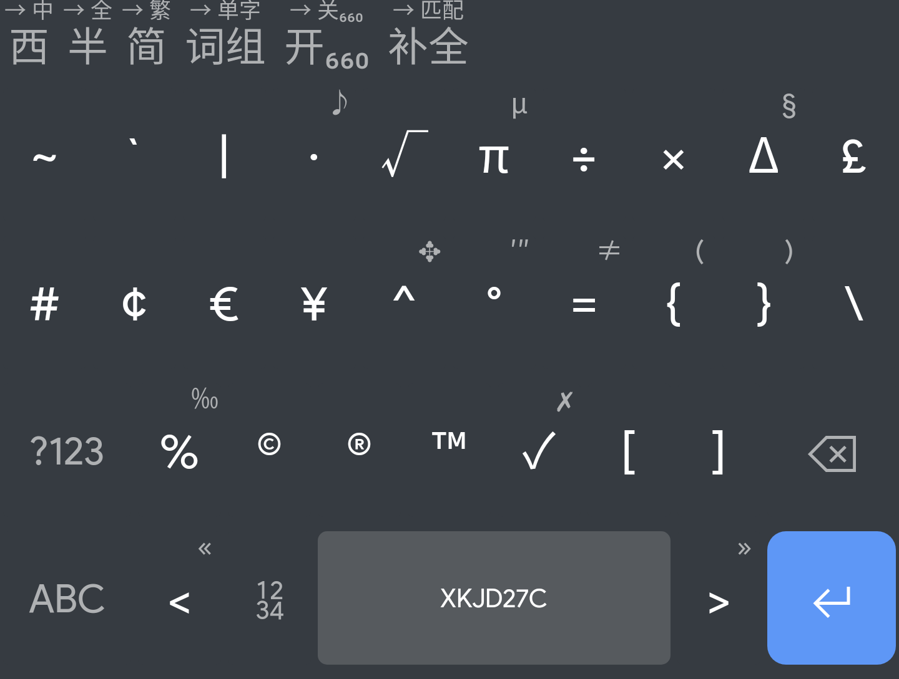
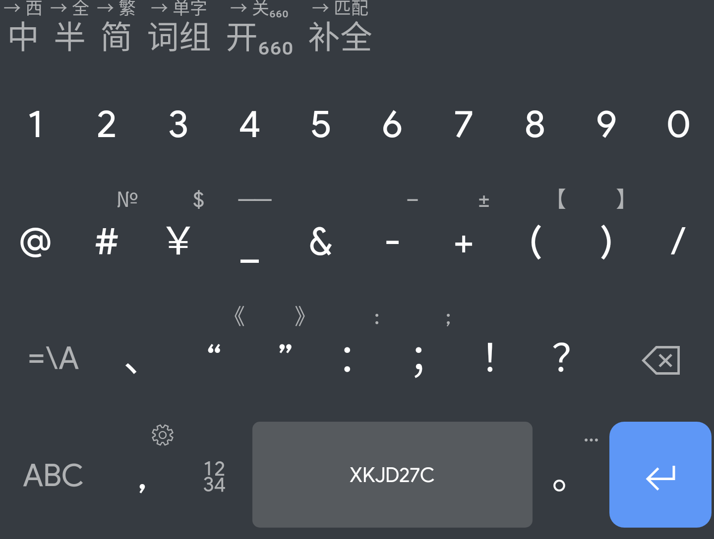
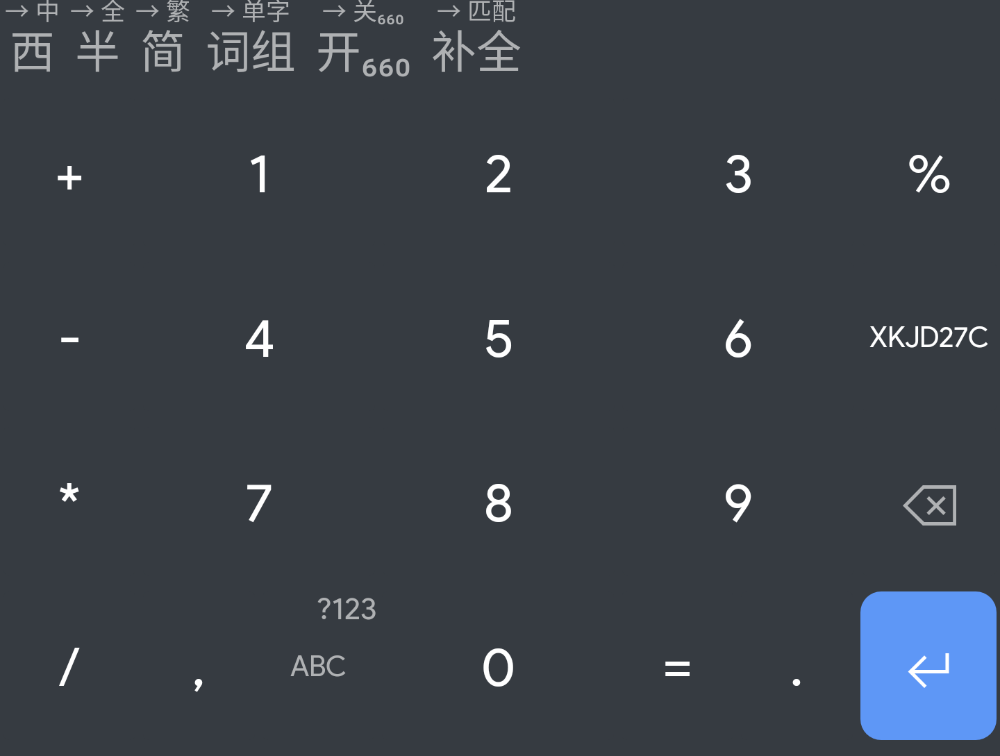

# Trime Gboard Dark Colemak

A Gboard Dark theme for Trime with Colemak layout.  
面向同文输入法的 Gboard 暗色风格 Colemak 键盘布局。

推荐搭配 [Rime 星空键道 27C Colemak 布局双形输入方案](https://github.com/xkjd27/rime_jd27c)使用。

## 截图

| 英文布局 | 英文符号 | 英文次要符号 |
| - | - | - |
|  |  |  |

| 中文布局 | 中文符号 | 中文次要符号 |
| - | - | - |
|  |  |  |

| 九宫格数字 |
| - |
|  | 

## 使用方法
* 备份 Rime 文件夹内的内容。
* 将 `trime.custom.yaml` 文件和 `fonts` 文件夹下载到 Rime 目录下。
* 若正在使用其他输入方案，请将 `trime.custom.yaml` 内所有的 `xkjd27c` 字样替换为正在使用的方案 ID。
* 部署同文输入法。

## 授权
* `trime.custom.yaml` by Eana Hufwe released under MIT License
* Segoe MDL2 Assets by Microsoft Corporation
* Product Sans and Gboard design by Google Inc